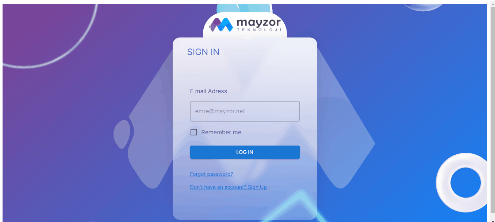

## Proje Hakkında

Kullanıcılara ait listenin görüntülendiği silme ve düzenleme işlemlerinin yapıldığı bir dasboard uygulamasıdır. E mail ile dashboard sayfasına ulaşılabilir bunu sağlamak için private router kullanıldı. Geçerli bir e mail girildikten sonra kullanıcıların listesinin olduğu sayfaya ulaşıyor. Buradan düzenleme butonuna basıldığında kullanıcının detaylı bilgi sayfasına ulaşılıyor.

## Proje Çıktısı

## Bilgisayarınızda Çalıştırın

Projeyi klonlayın

```bash
  git clone https://github.com/zeyasar/mayzor-task
```

Gerekli paketleri yükleyin

```bash
  npm install
```

Projeyi browserda açmak için
```bash
  npm start
```